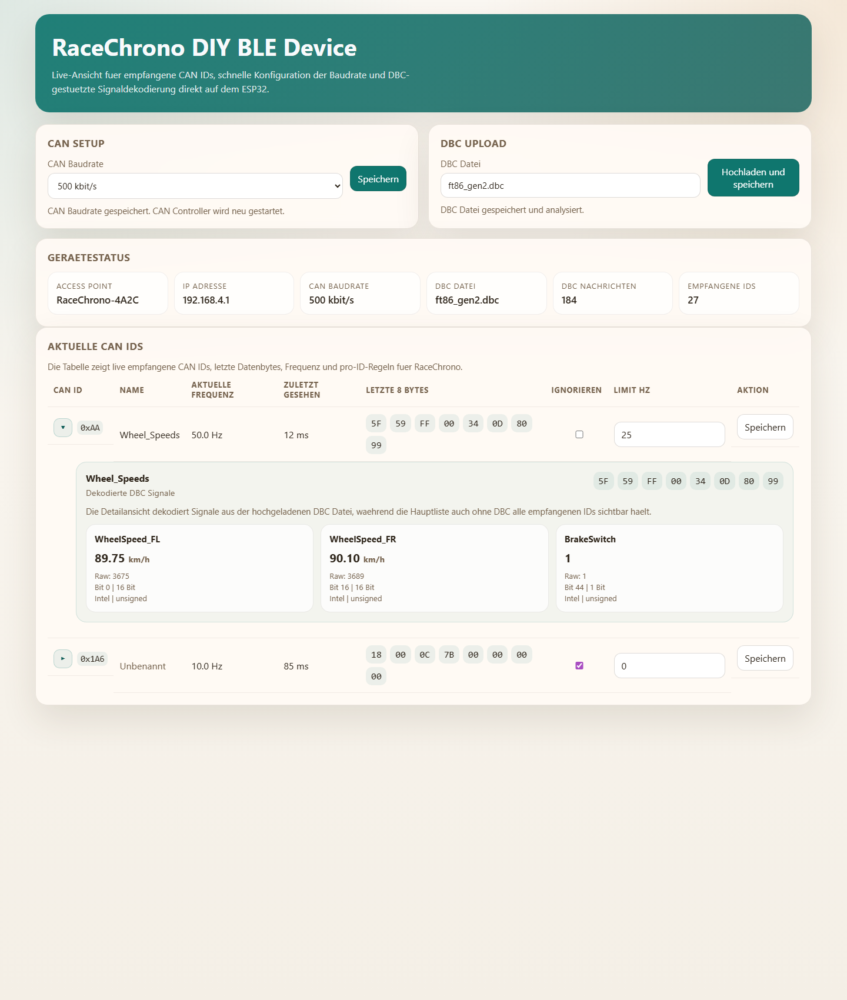

# RaceChronoDiyBleDevice

DIY BLE CAN bridge for RaceChrono on ESP32.

This project reads directly from a vehicle CAN bus, filters and rate-limits the
traffic on the ESP32, and forwards the selected data to RaceChrono over
Bluetooth Low Energy (BLE). It is intentionally vehicle-independent: there is
no OBD-II-specific workflow, no compile-time car profile, and no `config.h`
editing to change CAN channels or CAN timing.

The firmware exposes its own access point and a built-in web UI. From that UI
you can:

* inspect all currently received CAN IDs live
* see the observed update frequency per ID
* inspect the last 8 raw data bytes per ID
* ignore IDs or apply an additional per-ID transmit limit for RaceChrono
* change the CAN baud rate at runtime
* upload a DBC file so messages are labeled and decoded in an expandable detail view

All of that configuration is stored in the ESP32 flash.



The checked-in firmware targets PlatformIO and the application lives in
`src/main.cpp`. There is no Arduino `.ino` sketch anymore.

## Demo

Here is a video made with RaceChrono using data acquired through this project:

[](https://www.youtube.com/watch?v=R1ucTVodH9Q)

## Safety disclaimer

CAN bus is like a "nervous system" in a car. It is a network that connects
various ECUs, sensors, etc. Connecting a new device to this network poses risks
such as data corruption, packet losses, etc., that can negatively affect the
performance of some or all components of a car. The same applies to incorrect
connections and alterations to the CAN bus wiring. This can cause undesirable
effects such as warning lights, electrical and mechanical damage, loss of
control, injuries, and death.

By using any information, hardware designs, or code in this project you assume
all risk and release any liability from the author(s) and contributors.

## High level workflow

1. Connect the SK Pang ESP32 CAN board to vehicle power and the target CAN bus.
2. Build and flash the firmware with PlatformIO.
3. Join the ESP32 access point and open the web UI.
4. Set the CAN baud rate and verify that live CAN traffic appears.
5. Optionally upload a DBC file to label frames and decode signals.
6. Configure per-ID ignore or transmit-rate rules for RaceChrono.
7. Connect RaceChrono over BLE and start logging.

## Hardware

This repository is documented for an SK Pang ESP32 CAN board with integrated
CAN hardware and onboard 12 V support. For the intended setup you do not need a
breadboard, a separate CAN transceiver module, or an external buck converter.

In practice the installation is simple: power the board from the vehicle and
connect it directly to the CAN pair.

Connection | Vehicle side
---------- | ------------
12 V input | Vehicle 12 V supply
GND | Vehicle ground / supply return
CAN H | Target CAN H
CAN L | Target CAN L

Use a twisted pair for CAN H and CAN L, keep polarity correct, and make sure
the board shares a proper ground reference with the bus power source.

The firmware uses the ESP32 CAN controller stack that matches the SK Pang
examples and the `ESP32CAN` library. The default mapping is CAN TX on GPIO25
and CAN RX on GPIO26.

## Building and installing the firmware

Install PlatformIO Core or use the PlatformIO VS Code extension.

All required libraries are declared in `platformio.ini`, so no manual Arduino
library installation is needed.

Build the firmware with:

```sh
platformio run
```

Upload to a connected ESP32 with:

```sh
platformio run -t upload
```

Open a serial monitor with:

```sh
platformio device monitor -b 115200
```

After boot, the ESP32 starts an access point named `RaceChrono-XXXX` and serves
the web UI on `http://192.168.4.1/`.

If you port the firmware to hardware that uses different CAN pins, add the
appropriate build flags for that target environment.

## Working with the web UI

Once connected to the ESP32 access point, the web UI is the control surface for
the whole device:

1. Set the CAN baud rate and save it to flash.
2. Watch the live table of received CAN IDs update in the background.
3. Inspect the last raw bytes and observed message frequency for each ID.
4. Upload a DBC file to attach message names and decode signal values.
5. Expand any received CAN ID to inspect the decoded signal list.
6. Mark noisy IDs as ignored or add a transmit-rate limit for RaceChrono.

The live table keeps refreshing data without replacing the active form fields,
so you can edit rules while traffic continues to update.

## Generating DBC documentation

This repository also includes a small generator that converts DBC files into
RaceChrono formula documentation. It scans every signal in the source DBC,
builds the corresponding RaceChrono equation, and writes a Markdown table into
`can_db/`.

By default it reads all `*.dbc` files from `dbc/` and creates matching
`*.md` files in `can_db/`:

```sh
bash tools/generate_racechrono_can_db.sh
```

If you want to point it at a different DBC file or output directory, pass the
input path first and the output path second:

```sh
bash tools/generate_racechrono_can_db.sh dbc can_db
```

The Bash wrapper calls the Python helper in `tools/generate_racechrono_can_db.py`.
On systems without Bash you can run the helper directly:

```sh
python tools/generate_racechrono_can_db.py dbc can_db
```

The generated formulas reconstruct the physical values from the DBC. For
RaceChrono channels that expect a different internal unit or a more curated
channel mapping, you may still want to adjust the generated formula manually.

## Bench testing

Before connecting to a car, it is useful to test with any other CAN node or CAN
simulator that can transmit frames at the target baud rate.

You can keep the serial monitor and the web UI open during this step. Even
without RaceChrono connected yet, the UI will show received CAN IDs, byte data,
and DBC decoding results.

## Vehicle integration

The firmware is vehicle-independent. The only vehicle-specific part is the
physical tap point and harness you use to reach the CAN pair and power.

Research the correct CAN wires and power source for your platform, make the
connections cleanly, and verify polarity before powering the board. Once the
board is connected to 12 V and the correct CAN H/CAN L pair, the remaining
setup happens through the web UI.

## Contributions

Contributions are welcome, especially around documentation, CAN decoding, and
general reliability improvements.

## Support the project

I hope you found this project useful, entertaining, or educational.
Personally, I was amazed that for just ~$50 it's possible to get a data logging
system comparable to the "go to" devices that HPDE enthusiasts use that cost
10x more. And since the "brain" of such a data acquisition system is
RaceChrono, you don't need to fiddle with cables or laptops to review your data
when you come back to the pits between sessions.

Having said that, I've spent a few too many evenings on this project, and this
is not my paid job. I have some more exciting ideas on how to further improve
this project, make it more accessible, and support more cars, but I can't
justify spending too much more time on it. If you want to thank me for what
I've already shared, or support future ideas, I will appreciate it if you send
me some "boba tea money".

Here's a PayPal shortcut for your convenience:

[](https://www.paypal.com/donate?business=ZKULAWZFJKCES&item_name=Donation+to+support+the+RaceChronoDiyBleDevice+project+on+GitHub&currency_code=USD)
